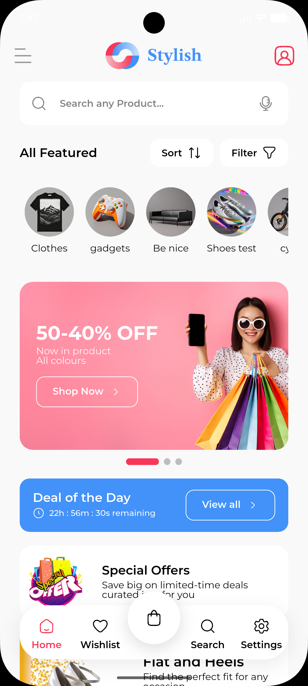
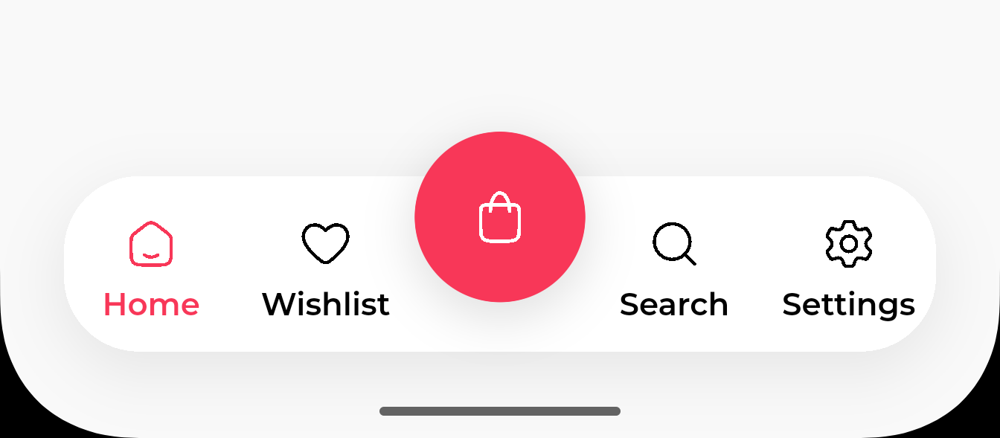

<div align="center">

# Stylish

### A scalable Flutter eCommerce application built with a feature-first clean architecture, Cubit state management, state-driven GoRouter, and bilingual localization.

[](https://flutter.dev)
[](https://dart.dev)
[](https://pub.dev/packages/flutter_bloc)
[](#)
[](#)
[](#)

</div>

---

## Overview

**Stylish** is a production-grade Flutter eCommerce starter designed around three core principles:

- **Predictable state** — a single `AppStatus` enum drives the entire router.
- **Modular features** — every feature is self-contained under `features/<name>/`.
- **Real-world patterns** — no magic, no over-engineering, no hidden behavior.

The codebase emphasizes **maintainability**, **modular feature development**, and **clean separation
of concerns**, so each feature can be added, modified, or removed without touching unrelated code.

---

## Development Branch Snapshot

> Summary of merged feature branches into `development`.


---

## Screenshots

### Home & Navigation

A modern home experience with a curved top profile, full search, category carousel, promotional
banner with pagination, and a custom bottom navigation bar with a floating cart action.

|                    Home                    |               Bottom Navigation                |
|:------------------------------------------:|:----------------------------------------------:|
|  |  |

### Splash & Onboarding

|                 Splash                  |                    Onboarding 1                     |                    Onboarding 2                     |                    Onboarding 3                     |
|:---------------------------------------:|:---------------------------------------------------:|:---------------------------------------------------:|:---------------------------------------------------:|
|  |  |  |  |

### Authentication

|              Login               |               Signup               |                   Forgot Password                    |                 First Login                  |
|:--------------------------------:|:----------------------------------:|:----------------------------------------------------:|:--------------------------------------------:|
|  |  |  |  |

---

## Tech Stack

| Category         | Technology                                                                    |
|------------------|-------------------------------------------------------------------------------|
| Framework        | Flutter 3.5+ (Dart `>=3.5.0 <4.0.0`)                                          |
| State Management | `flutter_bloc` (Cubit + Equatable states)                                     |
| Navigation       | `go_router` with state-driven `RouterGuard`                                   |
| Networking       | `dio` + `pretty_dio_logger` + custom interceptors                             |
| Local Storage    | `hive_ce` / `hive_ce_flutter`, `shared_preferences`, `flutter_secure_storage` |
| DI               | `get_it` (manual registration)                                                |
| Localization     | `easy_localization` (`assets/translations/{en,ar}.json`)                      |
| UI               | Material 3, `flutter_screenutil`, `google_fonts` (Montserrat)                 |
| Animations       | `flutter_animate`, `smooth_page_indicator`                                    |
| Media            | `image_picker`, `cached_network_image`, `flutter_svg`                         |
| Connectivity     | `connectivity_plus`, `internet_connection_checker_plus`                       |
| Icons            | `hugeicons` (and Material icons)                                              |
| UX extras        | `skeletonizer`                                                                |
| Logging          | `logger` (custom `LoggerService` wrapper)                                     |
| Splash/Icons     | `flutter_native_splash`, `flutter_launcher_icons`                             |
| Custom utility   | `flutter_skill` helpers used in formatters/validators                         |

---

## Features

- **Material 3** design system with **light & dark** themes (system-driven).
- Fully **responsive** UI across phones, tablets, and split-screen via `flutter_screenutil`.
- **State-driven navigation** through a single `AppStatus` enum — the router never asks
  *"is this route allowed?"*, it only asks *"given the state, where should the user be?"*.
- **Token lifecycle** with secure storage, single-flight automatic refresh on `401`,
  and forced logout on refresh failure.
- **Onboarding flow** (3 pages) with PageView, animated dots, prev/next/skip, and
  a `.tr()`-driven title/subtitle.
- **Authentication** — Login, Signup, Forgot Password — with social login button UI
  shells (Google / Apple / Facebook) and a debug `AuthFlowTest` screen.
- **Bilingual** English / Arabic support, with full nested key namespaces
  (`auth.login.*`, `onboarding.steps.*`, etc.).
- **Connectivity-aware** behavior (`ConnectivityService` + `OfflineBanner`).
- **Toast-style feedback** (`FeedbackHandler` + `FeedbackCard`) for success, error,
  info, and warning messages.
- **Feature-based structure** — every feature is self-contained and follows the
  same layout.

---

## Architecture

This project follows a **feature-first clean architecture** with explicit
separation between **presentation** and **data**. There is **no separate domain
layer** — the project scope doesn't justify the extra indirection.

### Per-feature layout

```
features/<feature>/
├── data/
│   ├── models/         # Plain Dart classes (Equatable), JSON factories
│   └── repositories/   # Abstract + Impl, return Either<Failure, T>
└── presentation/
    ├── manager/        # Cubit + State (Equatable)
    ├── views/          # Screens (Scaffold + SafeArea + BlocBuilder)
    └── widgets/        # Reusable UI fragments consumed by views
```

### Core (cross-cutting) layout

```
core/
├── constants/   # AppConstants, AppAssets, AppStrings (translation keys)
├── di/          # get_it registration (initDependencies + sl)
├── networking/  # ApiConsumer (abstract) + DioConsumer + ApiInterceptors + ApiEndpoints
├── routing/     # GoRouter setup + RouteNames + RouterGuard
├── services/    # auth/, connectivity/, logger/, media/, security/, session/, storage/
├── errors/      # Failure hierarchy + safe_call (Either<Failure, T>)
├── theme/       # colors/, typography/, themes/ (light + dark)
├── shared/      # buttons/, feedback/, images/, inputs/, layout/, loading/
├── localization/# LocalizationHelper (supportedLocales, path, fallback)
├── formatters/  # currency, date, phone
├── helpers/     # showAppDialog, showAppBottomSheet
├── functions/   # copyToClipboard, hideKeyboard, isTablet, getContrastColor
├── hooks/       # TimerManager (countdown streams)
├── validators/  # Centralized AppValidators (email, password, name, etc.)
├── pagination/  # PaginationHelper + PagedList<T>
├── observer/    # AppBlocObserver (debug logger)
├── wrappers/    # ScreenUtilWrapper, ConnectivityWrapper
└── dev/         # DevTools + AuthFlowTest (debug-only utilities)
```

### Data flow

```
View (Widget)
   │  user interaction
   ▼
Cubit (presentation/manager)
   │  method call (e.g. login())
   ▼
Repository (data/repositories)
   │  safeCall(() async { ... })
   ▼
ApiConsumer (Dio)  /  Storage  /  External service
   │  throws on failure, returns raw response
   ▼
safeCall catches → Either<Failure, T>
   │
   ├── Left(Failure)   → Cubit emits Error state + FeedbackHandler.error
   └── Right(value)    → Cubit emits Success state (and triggers side effects)
```

The router reacts to state changes via the `SessionManager` (`ChangeNotifier`) —
UI screens **never** call `context.go(...)` to switch the "home" screen after
login; the redirect logic handles it.

---

## State-Driven Routing (the heart of the app)

`SessionManager` exposes a single enum — `AppStatus` — that represents the
user's high-level state:

| Status                    | Meaning                                          | Routed to          |
|---------------------------|--------------------------------------------------|--------------------|
| `initial`                 | Before `initialize()` completes                  | `/onboarding`      |
| `onboardingRequired`      | First launch, onboarding not done                | `/onboarding`      |
| `unauthenticated`         | Onboarding done, no valid token                  | `/login`           |
| `authenticatedNeedsSetup` | Fresh login, "getting started" not yet dismissed | `/getting-started` |
| `authenticated`           | Fully ready                                      | `/home`            |

Sibling routes (e.g. `signup` and `forgot-password` while unauthenticated) are
allowed within the same state. Public/bypass routes (e.g. `/auth-flow-test`)
skip the guard entirely. **No permission blacklists, no per-route role
checks** — the router reasons about state, not permissions.

Transitions (all go through `SessionManager`):

```
completeOnboarding() → onboardingRequired → unauthenticated
login(access, refresh) → unauthenticated → authenticatedNeedsSetup
markReady()            → authenticatedNeedsSetup → authenticated
logout()               → any → unauthenticated
token refresh fails    → any → unauthenticated
```

---

## Project Structure (full)

```
lib/
├── main.dart
├── app.dart
├── core/                  # see architecture above
└── features/
    ├── onboarding/        # Fully implemented (reference feature)
    ├── auth/              # Login, Signup, Forgot Password
    └── home/              # HomeView + GettingStartedView
```

### Feature: `onboarding` (reference)

- **Data:** `OnboardingPage` model + static `onboardingPages` list (3 pages).
- **Cubit:** `OnboardingCubit` with `OnboardingState { currentPage, completed }`.
- **View:** `OnboardingView` — `PageView.builder` + animated dots + footer with
  `Skip` / `Prev` / `Next` / `Get Started`.
- **Routing:** created on demand via
  `BlocProvider(create: (_) => sl<OnboardingCubit>())`.

### Feature: `auth`

- **Data:** `AuthTokens`, `UserModel` (Equatable + `fromJson`).
- **Repository:** `AuthRepository` (abstract) + `AuthRepositoryImpl`.
    - `login()` calls `/auth/login` → tokens → `SessionManager.login()` →
      returns tokens. Throws `AuthFailure` if session validation fails.
    - `register()` calls `/users` with name/email/password/avatar → returns
      `UserModel`. Does **not** auto-login.
    - `checkEmailAvailability()` calls `/users/is-available` → bool.
- **Cubits:**
    - `AuthLoginCubit` → `AuthLoginState { Initial | Loading | Success | Error }`.
    - `AuthRegisterCubit` → `AuthRegisterState { Initial | Loading | Success | Error }`.
- **Views:** `LoginView`, `SignupView`, `ForgotPasswordView`.
- **Widgets:** `LoginForm`, `SignupForm`, `ForgotPasswordForm`, `LoginFooter`,
  `SignupFooter`, `SocialLoginSection`, `SocialButton`, `TermsAgreement`.

> **Note on auto-login after signup:** Registration does **not** persist tokens.
> The user lands on the login screen after a successful register.

### Feature: `home`

- `HomeView` — search header, category carousel, promotional banner with
  pagination, deal of the day countdown, special offers, and a curved
  bottom navigation bar.
- `GettingStartedView` — full-screen image with gradient overlay + "Get Started"
  button. The button calls `sl<SessionManager>().markReady()`, which is what
  triggers the redirect to `/home`. No `context.go(...)`.

---

## Branching Strategy

Each major feature is developed in an isolated branch:

- `features/onboarding` — Onboarding flow (UI + Cubit + state-driven routing).
- `features/auth/login` — Login flow (UI + API + Cubit).
- `features/auth/signup` — Signup flow (UI + API + Cubit).
- `features/home` — Home screen + bottom navigation + Getting Started.

**Benefits:** isolated development, fewer merge conflicts, clean history, easier
code review, and better team scalability.

---

## Development Approach

- **Feature-first** — every feature is self-contained, independent, and can be
  deleted without breaking other features.
- **Theme-driven UI** — widgets never hardcode colors, sizes, or text styles.
  Pull from `AppColors`, `AppTypography`, and `theme.colorScheme` /
  `theme.textTheme`.
- **State-driven navigation** — UI never decides *where* the user should be.
- **Contract-driven data** — every repository is an `abstract` class; the impl
  is the only thing that touches `ApiConsumer` / `Storage`.
- **Localization by default** — no hardcoded user-facing strings.

---

## Getting Started

```bash
# Install dependencies
flutter pub get

# Run on a connected device / emulator
flutter run

# Static analysis (lints + analyzer)
flutter analyze

# Run tests
flutter test

# Format code
dart format .

# Regenerate launcher icons (config: flutter_launcher_icons.yaml)
dart run flutter_launcher_icons

# Regenerate native splash (config: flutter_native_splash.yaml)
dart run flutter_native_splash:create
```

- **Dart SDK:** `>=3.5.0 <4.0.0`
- **Flutter:** 3.5+
- **Platforms configured:** Android, iOS, Web, Windows, macOS (`.metadata`).

---

## Roadmap

- [✅] Onboarding flow with state-driven routing
- [✅] Authentication (Login, Signup, Forgot Password)
- [✅] Token lifecycle with auto-refresh
- [✅] Connectivity-aware UI
- [✅] Bilingual EN/AR localization
- [✅] Home screen with bottom navigation
- [ ] Product catalog & details
- [ ] Cart & checkout
- [ ] Wishlist persistence
- [ ] Push notifications
- [ ] Payment integration

---

## License

Released under the **MIT License**. See `LICENSE` for details.

---

<div align="center">

Crafted with care using Flutter.

</div>
