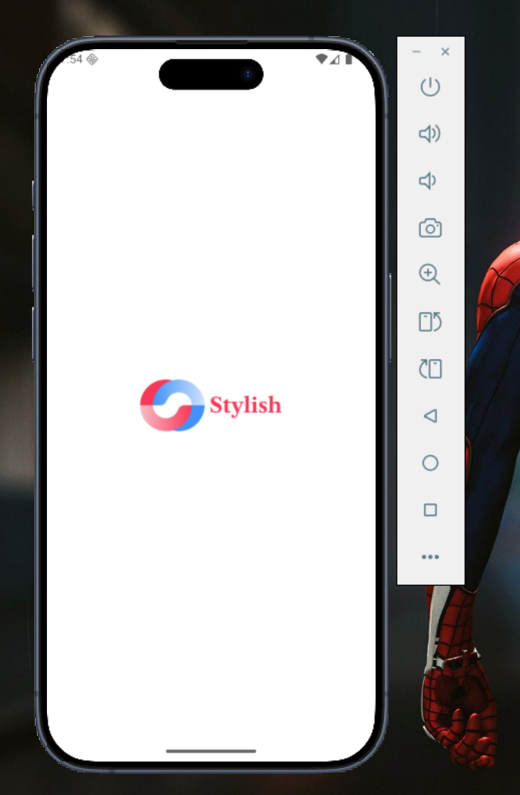
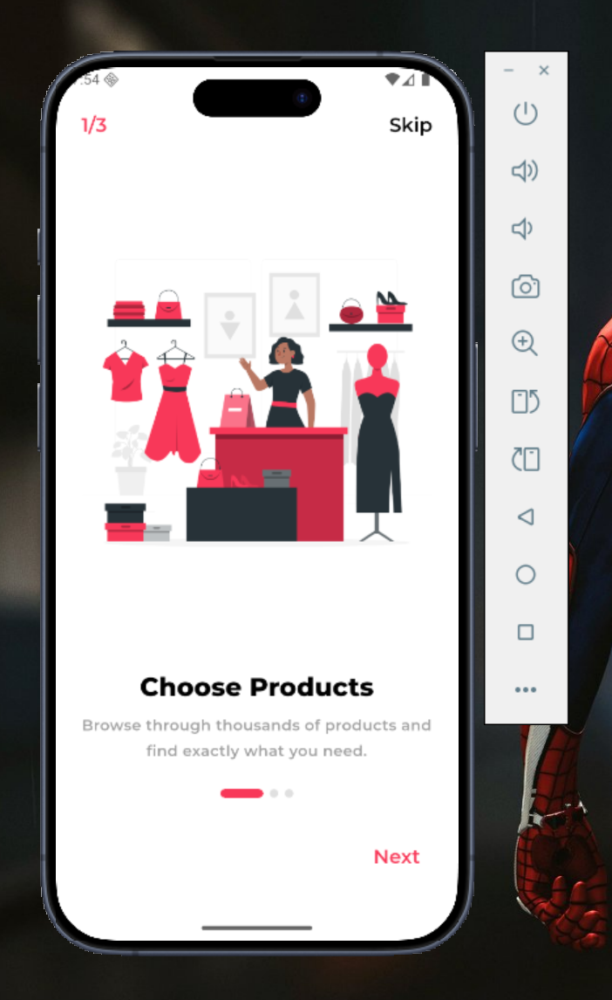
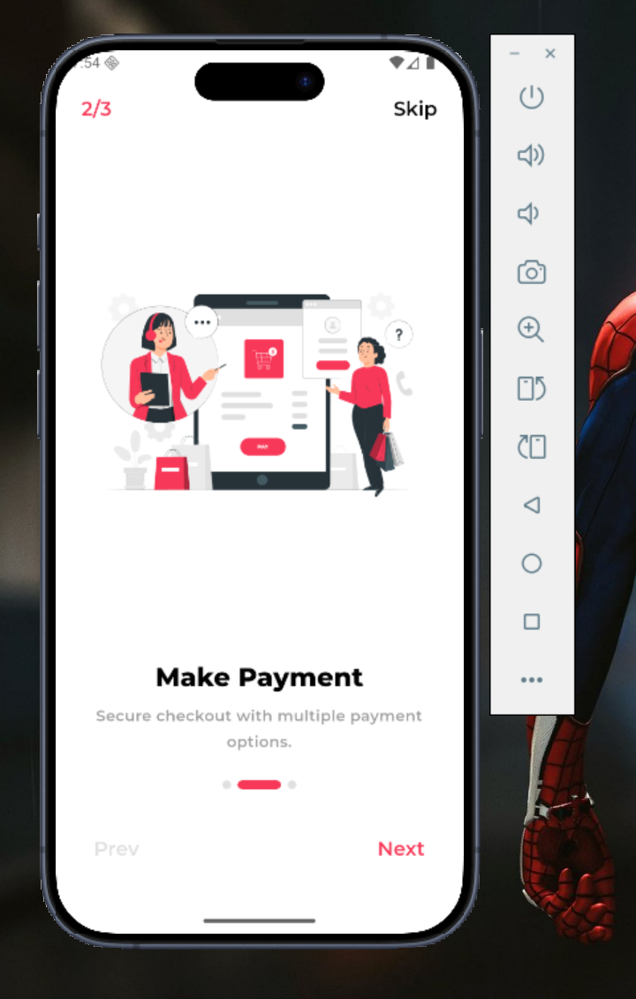
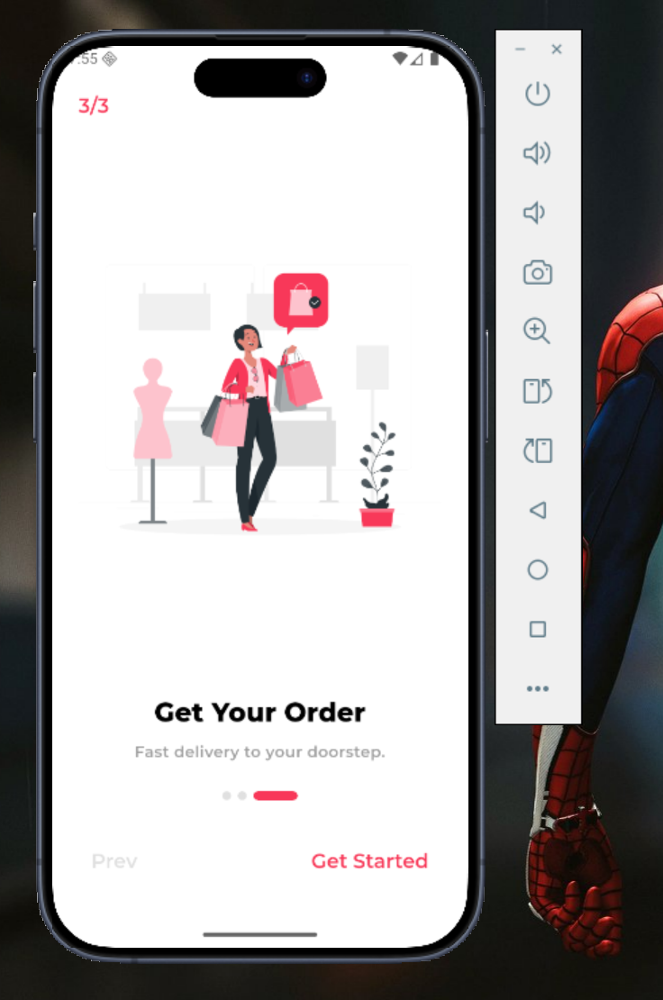
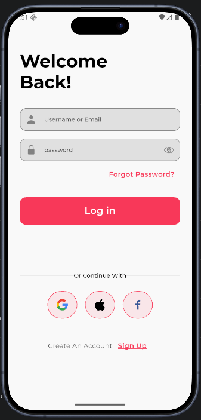
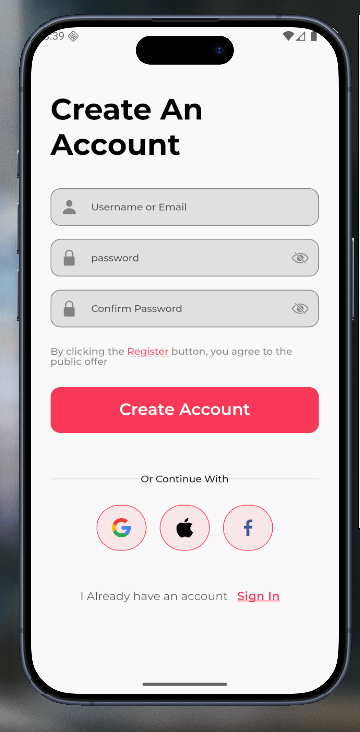
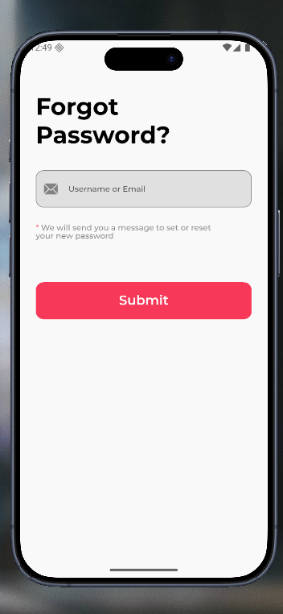

# Stylish

A scalable Flutter eCommerce application built with MVVM architecture, responsive UI, localization support, and clean design system principles.

---

## Tech Stack

| Category | Technology |
|----------|------------|
| **Framework** | Flutter 3.5+ |
| **State Management** | flutter_bloc (Cubit) |
| **Navigation** | go_router |
| **Networking** | Dio |
| **Local Storage** | Hive, SecureStorage |
| **Localization** | easy_localization |
| **UI** | Material 3, ScreenUtil |
| **Animations** | flutter_animate |

---

## Screenshots

### Splash Screen


### Onboarding
| Step 1 | Step 2 | Step 3 |
|--------|--------|--------|
|  |  |  |

### Authentication
| Login | Signup | Forgot Password |
|-------|--------|-----------------|
|  |  |  |

---

## Features

- Material 3 theming with light/dark mode support
- Onboarding flow with smooth animations
- Responsive layouts using ScreenUtil
- Bilingual support (EN/AR)
- Reactive state management with Cubit
- Clean architecture with repository pattern
- Secure credential storage
- Network connectivity monitoring

---

## Getting Started

```bash
# Install dependencies
flutter pub get

# Run the app
flutter run
```

---

## Project Structure

```
lib/
├── core/           # Shared utilities, theme, widgets, DI
├── features/       # Feature modules (data + presentation)
├── routes/         # App routing configuration
└── main.dart       # Entry point
```

---

## License

This project is proprietary software. All rights reserved.